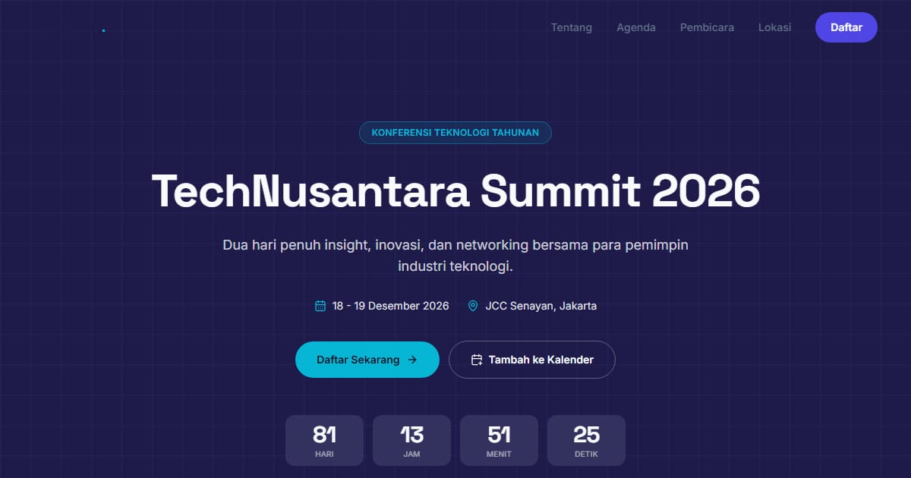

# Undangan Digital — Corporate (Conference Website)

**Demo live:** https://undangan-corporate-delta.vercel.app



> Undangan contoh dengan data fiktif. Formulir registrasi hanya demo dan tidak mengirim data.

Paradigma **paling beda**: ini **situs acara/konferensi**, bukan undangan personal bergerbang. Tidak ada "Buka Undangan" — langsung landing page yang bisa di-scroll & dinavigasi.

- **NavBar** — sticky, menu anchor + menu mobile (hamburger) + tombol **Daftar**
- **Hero** — judul + CTA "Daftar Sekarang" / "Tambah ke Kalender" + countdown
- **Stats** — angka peserta/pembicara/sesi/hari
- **About** — tentang acara + poin highlight
- **Agenda** — rundown sesi (waktu, judul, pembicara, track)
- **Speakers** — grid kartu pembicara
- **Sponsors** — logo berjenjang (Platinum/Gold/Silver)
- **LocationSection** — venue + peta + petunjuk arah
- **Register** — form registrasi peserta (tipe tiket)
- **Footer** — brand, navigasi, kontak, sosial, copyright

Tema **indigo & cyan**, font **Space Grotesk + Inter**, grid hero. `page.js` adalah server component; interaktivitas di komponen client (NavBar/Hero/Register). Responsif terverifikasi (320/375/768px).

## Menjalankan
```bash
npm install && npm run dev
```
Semua konten di **`lib/data.js`** (objek `hero`, `agenda`, `speakers`, `sponsors`, `tickets`).

---

Bagian dari koleksi 8 undangan digital di [PortalUndangan](https://portal-undangan-eta.vercel.app). Dibuat oleh [PintuWeb](https://pintuweb.com), jasa pembuatan website.
